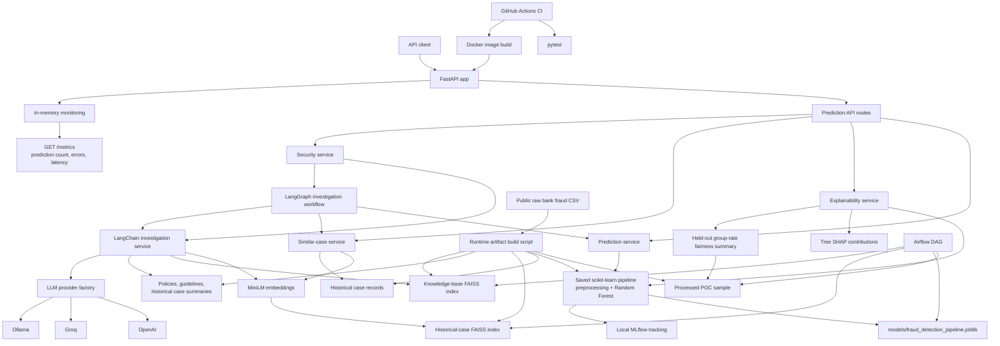

# Architecture

## Components

- **FastAPI:** exposes prediction, explainability, fairness, retrieval, investigation, agent, health, comparison, and metrics endpoints. Runtime monitoring records only `/predict` request count, error count, and latency in process memory.
- **Prediction and explainability:** the prediction service loads the saved preprocessing-plus-Random-Forest pipeline. The explainability service uses Tree SHAP and calculates descriptive fairness group rates from the processed POC sample.
- **Retrieval and investigation:** MiniLM creates embeddings for persisted FAISS indexes. Similar-case search retrieves historical cases; LangChain RAG retrieves policy, guideline, and case context before using a configured LLM or its deterministic fallback.
- **LLM and security:** the provider factory selects OpenAI, Groq, or Ollama from environment variables. The security service validates investigation inputs, filters retrieved content as untrusted, and checks generated output.
- **Agents:** the LangGraph workflow routes simple cases to direct assessment and complex cases through Fraud Analysis, Similar Case/Evidence, and Investigation Summary agents, using the existing services as tools.
- **MLOps:** final-model training logs parameters, metrics, and artifacts to local MLflow. The Airflow DAG validates saved runtime assets and performs a lightweight deterministic model evaluation without retraining.
- **Delivery:** Docker packages the FastAPI app, saved model, FAISS indexes, and knowledge-base artifacts. GitHub Actions installs dependencies, runs pytest, and builds the Docker image; it does not deploy.
